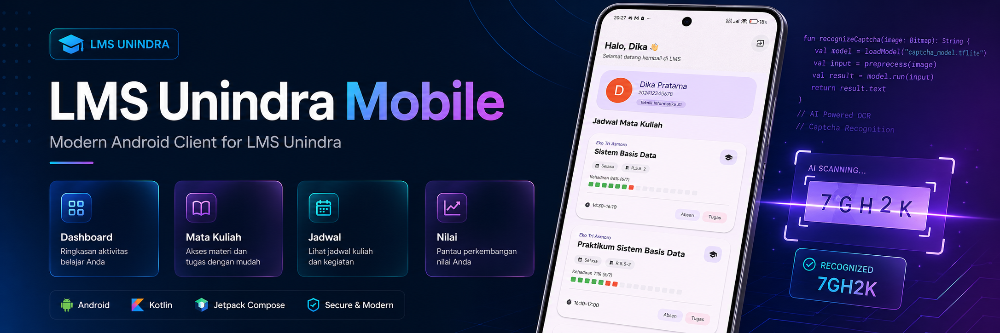

<p align="center">
  
</p>

<h1 align="center">LMS Unindra Mobile</h1>
<p align="center">
  Modern Android Client for LMS Unindra
</p>

# LMS Unindra

Aplikasi Android native berbasis Jetpack Compose untuk membantu mahasiswa mengakses LMS Unindra dari perangkat mobile. Proyek ini menangani login, mengambil data dashboard, menampilkan daftar pertemuan, membuka materi, melihat rekap presensi, mengunduh file, dan mengunggah tugas langsung dari aplikasi.

## Fitur Utama

- Login ke LMS Unindra menggunakan NIM dan password.
- Auto-login menggunakan kredensial yang disimpan secara aman dengan enkripsi AES-256 GCM.
- Pemecahan captcha matematika otomatis dengan ML Kit Text Recognition.
- Menampilkan profil mahasiswa dan daftar mata kuliah dari dashboard LMS.
- Menampilkan daftar pertemuan per mata kuliah.
- Menampilkan detail materi per pertemuan, termasuk file dan tautan eksternal.
- Rekap presensi per mata kuliah.
- Download materi ke folder `Downloads/elemes` dengan progress notification.
- Upload tugas langsung dari file picker dengan progress indicator.
- Pull-to-refresh di beberapa halaman utama.
- UI modern dengan efek glassmorphism (Haze).

## Stack Teknologi

- **Bahasa:** Kotlin
- **UI:** Jetpack Compose, Material 3, Haze (Glassmorphism)
- **Navigasi:** Navigation 3 (AndroidX)
- **Networking:** Ktor Client (CIO engine)
- **Parsing:** Jsoup
- **ML:** ML Kit Text Recognition
- **DI:** Koin
- **Storage:** Room (Database), DataStore (Preferences)
- **Security:** Google Tink (AES-256 GCM)
- **Image Loading:** Coil (termasuk dukungan GIF)
- **Concurrency:** Kotlin Coroutines

## Struktur Proyek

```text
.
├── app/
│   ├── src/main/kotlin/com/gaje48/lms/
│   │   ├── MainActivity.kt
│   │   ├── LmsApplication.kt
│   │   ├── data/             # Layer data (Repository & Data Sources)
│   │   ├── di/               # Konfigurasi Koin
│   │   ├── model/            # Data models
│   │   ├── navigation/       # Navigasi aplikasi
│   │   ├── ui/
│   │   │   ├── components/   # Komponen UI reusable
│   │   │   ├── screens/      # Halaman aplikasi (Login, Dashboard, dll.)
│   │   │   ├── state/        # ViewModel & UI State
│   │   │   └── theme/        # Tema & Styling
│   │   └── util/             # Helper utilities
│   └── src/main/res/
├── gradle/
├── build.gradle.kts
├── settings.gradle.kts
└── gradlew
```

## Alur Aplikasi

1. Pengguna login dengan NIM dan password LMS.
2. Aplikasi mengambil halaman login, membaca captcha menggunakan ML Kit, lalu mencoba login otomatis.
3. Setelah berhasil, aplikasi mem-parsing dashboard LMS untuk mengambil:
   - data mahasiswa,
   - daftar mata kuliah,
   - daftar pertemuan,
   - data presensi.
4. Pengguna dapat membuka detail pertemuan, mengunduh materi, melihat tugas, upload jawaban, dan mengecek presensi.

## Persyaratan

- Android Studio versi terbaru (mendukung AGP 9.2+)
- Android Gradle Plugin `9.2.0`
- Kotlin `2.3.20`
- JDK 17
- Perangkat atau emulator Android dengan minimum SDK 29 (Android 10)
- Koneksi internet untuk mengakses `https://lms.unindra.ac.id`

## Cara Menjalankan

### 1. Clone repository

```bash
git clone <url-repository>
cd lms-unindra
```

### 2. Buka di Android Studio

- Pilih `Open` lalu arahkan ke folder proyek ini.
- Tunggu proses Gradle sync selesai.

### 3. Jalankan aplikasi

- Hubungkan perangkat Android atau jalankan emulator.
- Klik tombol `Run` di Android Studio.

Atau lewat terminal:

```bash
./gradlew installDebug
```

## Build APK

Untuk build debug:

```bash
./gradlew assembleDebug
```

Untuk build release:

```bash
./gradlew assembleRelease
```

APK hasil build biasanya berada di:

```text
app/build/outputs/apk/
```

## Permission yang Digunakan

- `INTERNET` untuk komunikasi dengan LMS Unindra.
- `POST_NOTIFICATIONS` untuk notifikasi progress download dan upload pada Android 13+.

## Catatan Implementasi

- Kredensial pengguna disimpan menggunakan `DataStore` yang dienkripsi dengan `Google Tink`.
- Sesi login dipertahankan menggunakan `HttpCookies` plugin dari Ktor.
- Data LMS diambil dengan pendekatan HTML scraping menggunakan Jsoup.
- Auto-login akan mencoba ulang captcha hingga 3 kali.
- Download file diarahkan ke folder khusus `Downloads/elemes`.
- Beberapa endpoint LMS dipanggil secara langsung, sehingga perubahan struktur HTML atau endpoint dari pihak LMS dapat memengaruhi aplikasi.

## Disclaimer

Proyek ini dibuat untuk mempermudah akses ke LMS Unindra dan **bukan aplikasi resmi** kampus. Gunakan secara bertanggung jawab, terutama karena aplikasi menyimpan sesi login dan berinteraksi langsung dengan layanan LMS.

## Lisensi

Belum ada file lisensi di repository ini. Jika proyek akan dipublikasikan, sebaiknya tambahkan lisensi yang sesuai.
